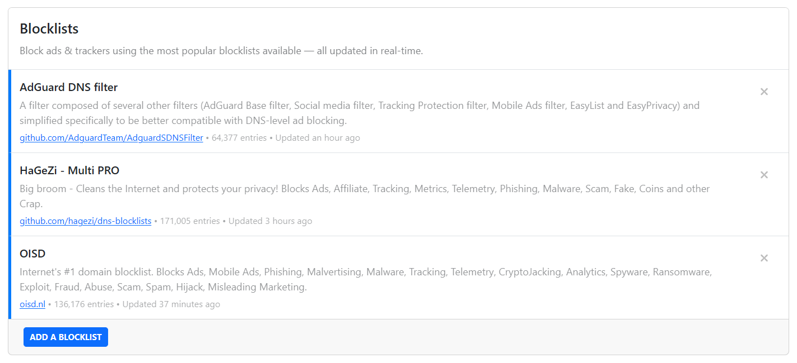
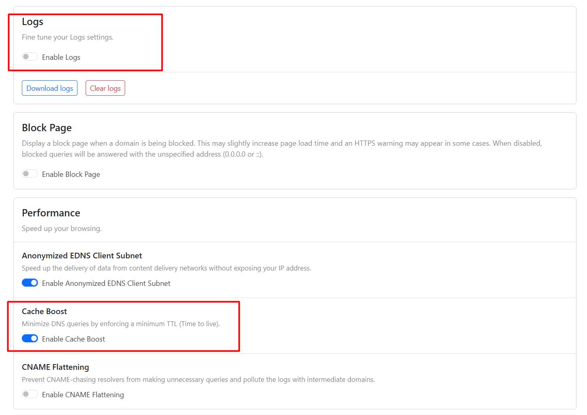

# My adblock recommended
My adblock recommended

# ---------------------------------------------------
# Public DNS over HTTPS

[Connect to public AdGuard DNS server](https://adguard-dns.io/en/public-dns.html)

[Avoid The Hack: 8 Best DNS Providers for Privacy (and adblocking)](https://avoidthehack.com/best-dns-privacy)

[Publicly available servers](https://github.com/curl/curl/wiki/DNS-over-HTTPS)

# ---------------------------------------------------

# [NextDNS](https://nextdns.io/?from=87sa6ga4)
- full nextdns [Blocklists](https://github.com/nextdns/blocklists/tree/main/blocklists)

## privacy
### Which blocklist should I use?
We recommend you **remove** the [NextDNS Ads & Trackers Blocklist](https://github.com/nextdns/blocklists/blob/main/blocklists/nextdns-recommended.json) and **add** the [minimum] number of useful lists.
- HaGeZi Multi **NORMAL** && **OISD** && **Adguard**: Block tracker, ad, and badware requests without issues **[set-and-forget]**
- HaGeZi Multi **PRO** && **OISD** && **Adguard**: Block more requests, usually without issues **(recommended)**

### Native Tracking Protection 

Add all the device brands you use.

	Windows
	Apple
	Samsung
	Xiaomi
	Huawei
	Amazon Alexa
	Roku
	Sonos

## settings 

# ---------------------------------------------------

***
# FAQ :question:

## I need a browser with ad blocking. Which one should I choose?

We based the recommendations below on a combination of effectiveness, resource efficiency, features, and ease of use.

| OS | Browser | Content Blocker |
|---|---|---|
| iOS | [Safari](https://www.privacyguides.org/en/mobile-browsers/#safari) | [AdGuard](https://www.privacyguides.org/en/browser-extensions/?h=adguard#adguard) |
| Android | [Brave](https://www.privacyguides.org/en/mobile-browsers/#brave) | Built-in blocker |
| Windows   macOS   Linux | [Firefox](https://www.mozilla.org/en-US/firefox/new/) (with [Betterfox](https://github.com/yokoffing/Betterfox#betterfox)) 

 [Brave](https://www.privacyguides.org/en/desktop-browsers/#brave) | [uBlock Origin](https://addons.mozilla.org/blog/ublock-origin-everything-you-need-to-know-about-the-ad-blocker/) 

 Built-in blocker or [uBlock Origin](https://addons.mozilla.org/blog/ublock-origin-everything-you-need-to-know-about-the-ad-blocker/) |  |

At the end of the day, if you're using [NextDNS](https://nextdns.io/?from=87sa6ga4) + any browser with an ad blocker, you have more coverage than most people.

# ---------------------------------------------------
# Mentions :books:

### YouTube
* [The ULTIMATE Guide to Mastering NextDNS!](https://www.youtube.com/watch?v=WUG57ynLb8I&t=2230s) | [clarifications](https://github.com/techlore/channel-content/issues/43) (July 2023) 

### Guides
* You can also check out Hagezi's own [recommendations](https://github.com/hagezi/dns-blocklists/tree/main#whatshouldiuse).
* [yokoffing NextDNS-Config ](https://github.com/yokoffing/NextDNS-Config?tab=readme-ov-file)
* [hagezi/dns-blocklists](https://github.com/hagezi/dns-blocklists#department_store-nextdns---limited-freepaid-) → Online DNS Services

### List 
* [Hagezi](https://github.com/hagezi/dns-blocklists)
* [1Hosts](https://github.com/badmojr/1Hosts)
* [Easylist](https://github.com/easylist/easylist)
* [uBlock Origin](https://github.com/uBlockOrigin/uAssets)
* [AdGuard](https://github.com/AdguardTeam/AdguardFilters)
* [FMHY](https://github.com/fmhy) → The Largest Collection of Free Stuff On The Internet!
